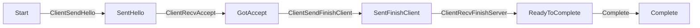
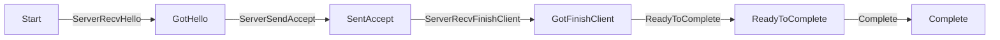
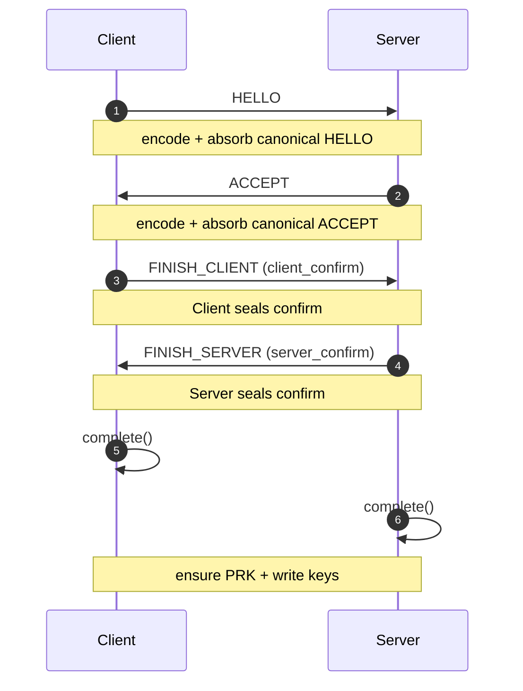

# Handshake State Machine (qsh v1)

Authoritative overview of the `HandshakeFsm` states, events, and legal
transitions. This complements (does not replace) the normative protocol
definition in `docs/spec.md`. If an inconsistency is ever observed, update the
spec first, then reconcile the implementation and this document.

## Goals

- Make control‑flow auditable (security review & fuzz target design).
- Provide a single table the tests can be validated against.
- Clarify when cryptographic side‑effects (PRK mix, key derivation, confirm
	tag seal/verify, sequence counter advancement) occur.

## Roles

Two roles exist: `Client` (initiator) and `Server` (responder). Role impacts:

- Permitted event set.
- Which side seals vs verifies each confirm tag.
- Which directional sequence counters advance (`client_write`, `server_write`,
	`client_read`, `server_read`).

## States

| State | Meaning (coarse progress) |
|-------|---------------------------|
| `Start` | No messages processed. |
| `SentHello` | Client: HELLO absorbed after send. (Server never enters; it moves to `GotHello`.) |
| `GotHello` | Server absorbed inbound HELLO. (Client mirror for symmetry only used indirectly.) |
| `SentAccept` | Server absorbed outbound ACCEPT. (Client mirror after receiving; then transitions to `GotAccept`.) |
| `GotAccept` | Client absorbed inbound ACCEPT. |
| `SentFinishClient` | Client sealed & absorbed FINISH_CLIENT (contains client confirm). |
| `GotFinishClient` | Server verified client confirm & absorbed FINISH_CLIENT. |
| `SentFinishServer` | Server sealed & absorbed FINISH_SERVER (contains server confirm). (Client will move directly to `ReadyToComplete` instead of mirroring this intermediate.) |
| `ReadyToComplete` | All required handshake messages + confirm(s) processed; key schedule material available; ready for `complete()`. |
| `Complete` | Transport keys installed into `KeySink`; handshake finalized. |

States are **monotonic**; regression is debug‑asserted and impossible via the
public API.

## Events

Internal events (enum `HandshakeEvent`) drive transitions:

| Event | Trigger (public API) | Role | Description |
|-------|----------------------|------|-------------|
| `ClientSendHello` | `on_start_client_send_hello` | Client | Absorb outbound HELLO. |
| `ClientRecvAccept` | `on_accept` | Client | Absorb inbound ACCEPT. |
| `ClientSendFinishClient` | `build_finish_client` | Client | Seal client confirm, absorb FINISH_CLIENT. |
| `ClientRecvFinishServer` | `on_finish_server` | Client | Verify server confirm, absorb FINISH_SERVER. |
| `ServerRecvHello` | `on_hello` | Server | Absorb inbound HELLO. |
| `ServerSendAccept` | `on_start_server_send_accept` | Server | Absorb outbound ACCEPT. |
| `ServerRecvFinishClient` | `on_finish_client` | Server | Verify client confirm, absorb FINISH_CLIENT. |
| `ServerSendFinishServer` | `build_finish_server` | Server | Seal server confirm, absorb FINISH_SERVER. |
| `MarkReady` | `ready()` (tests / orchestration convenience) | Both | Coerce/ensure advancement to `ReadyToComplete`. Idempotent / forward‑only. |
| `Complete` | `complete()` | Both | Install keys & finalize. |

## Transition Tables

### Client Role

| Current State | Event | Next State | Side Effects |
|---------------|-------|-----------|--------------|
| `Start` | `ClientSendHello` | `SentHello` | Encode+absorb HELLO. |
| `SentHello` | `ClientRecvAccept` | `GotAccept` | Encode+absorb ACCEPT. |
| `GotAccept` | `ClientSendFinishClient` | `SentFinishClient` | Derive (lazy) write keys (if PRK ready); seal client confirm; advance `client_write` seq; absorb FINISH_CLIENT. |
| `GotAccept` | `ClientRecvFinishServer` | `ReadyToComplete` | Derive (lazy) write keys (if needed); verify server confirm; advance `server_read` seq; absorb FINISH_SERVER. (Allows server sending FINISH_SERVER before client sends FINISH_CLIENT in edge orchestrations? No—client must send its finish first; see next row.) |
| `SentFinishClient` | `ClientRecvFinishServer` | `ReadyToComplete` | Verify server confirm; advance `server_read` seq; absorb FINISH_SERVER. |
| (any) | `MarkReady` | `ReadyToComplete` | No crypto side effects; purely a state coercion (only forward). |
| `ReadyToComplete` | `Complete` | `Complete` | PRK + write key ensure (if still lazy), install keys into `KeySink`, set starting seq counters. |

Note: The client path intentionally permits receiving `FINISH_SERVER` after it
has locally moved to `SentFinishClient` to accommodate timing where the server
optimistically produces FINISH_SERVER quickly after verifying the client
confirm (common case). The FSM still enforces that a server confirm cannot be
processed before ACCEPT is received.

### Server Role

| Current State | Event | Next State | Side Effects |
|---------------|-------|-----------|--------------|
| `Start` | `ServerRecvHello` | `GotHello` | Encode+absorb HELLO. |
| `GotHello` | `ServerSendAccept` | `SentAccept` | Encode+absorb ACCEPT. |
| `SentAccept` | `ServerRecvFinishClient` | `GotFinishClient` | Derive (lazy) write keys; verify client confirm; advance `client_read` seq; absorb FINISH_CLIENT. |
| `GotFinishClient` | `ServerSendFinishServer` | `ReadyToComplete` | Seal server confirm; advance `server_write` seq; absorb FINISH_SERVER. |
| (any) | `MarkReady` | `ReadyToComplete` | No crypto side effects. |
| `ReadyToComplete` | `Complete` | `Complete` | Ensure PRK & write keys; install keys; set starting seq counters. |

### Invalid Transitions

Any (state, event) pair not listed above yields
`ApplicationHandshakeError::ValidationError("invalid transition")` except for
explicit state validation guards in confirm handlers that produce more specific
messages (e.g., "invalid state for FINISH_CLIENT"). Future work will unify
messages to the format `invalid state: <operation>` (see TODO list).

### MarkReady Semantics

`MarkReady` is a *soft* event used by tests or orchestration layers that want
to force `ReadyToComplete` after all necessary messages/confirm logic has run.
If invoked early it still forces advancement but never skips mandatory crypto
side effects because those only occur inside the message handlers and confirm
processing (`build_*` / `on_*`). Thus calling `ready()` prematurely has no
security impact—it cannot conjure keys or confirms.

## Lazy Key Derivation & PRK

- PRK (`prk_from`) is set by `set_hybrid_shared()` (external) or synthesized
	inside `complete()` if still absent (using current transcript hash & shared
	secret passed to `complete()`).
- `WriteKeys` are derived once on first need (any confirm seal/verify or
	during `complete()`) via `derive_keys(th, prk)` and cached (`writes`).
- Subsequent confirm operations reuse the cached `WriteKeys` without recompute.

## Confirm Tags & Sequence Counters

Direction mappings:

| Confirm Role | AEAD Key Used | Sequence Counter Advanced |
|--------------|---------------|---------------------------|
| `ClientSends` | `writes.client` | `client_write` (send) OR `client_read` when verifying on server |
| `ServerSends` | `writes.server` | `server_write` (send) OR `server_read` when verifying on client |

Counters increment only after **successful** seal/verify. Failed verification
does not advance (preventing gap forging).

## Completion

`complete(th, hybrid_shared)` performs (in order):

1. State validation (`ReadyToComplete`).
2. PRK ensure (derive if absent from earlier explicit call).
3. Write key ensure (derive if not already cached by confirm path).
4. Move keys into `KeySink::install_keys` (consuming cached copy).
5. Seed starting send sequence counters via `KeySink::set_seqs` using the *next*
	 (post‑confirm) write counters accumulated so far.
6. Transition → `Complete` (idempotent via state check; second call would fail).

Read sequence counters (`client_read`, `server_read`) are internal only at this
stage; installation defers until transport layer binding requirements are
finalized (future ADR may extend `KeySink`).

## Sequence Diagram (Nominal Success Path)

## Security Review Checklist

When auditing changes to the FSM, ensure:

1. No new backward transitions were added (monotonicity preserved).
2. Confirm verification always precedes absorption of the FINISH frame.
3. Sequence counters only advance exactly once per successful confirm op.
4. Lazy derivation cannot occur with an uninitialized transcript hash.
5. Error messages do not leak secret material (they currently do not include
	 key / tag bytes; only coarse reasons).
6. `ready()` cannot bypass required confirm verification (it cannot).

## Future Improvements (Tracked in TODO List)

- Unify invalid state error message format.
- Expose a read‑only `transcript_hash()` accessor for external diagnostics.
- Potentially export a machine‑readable transition map for fuzz orchestration.

